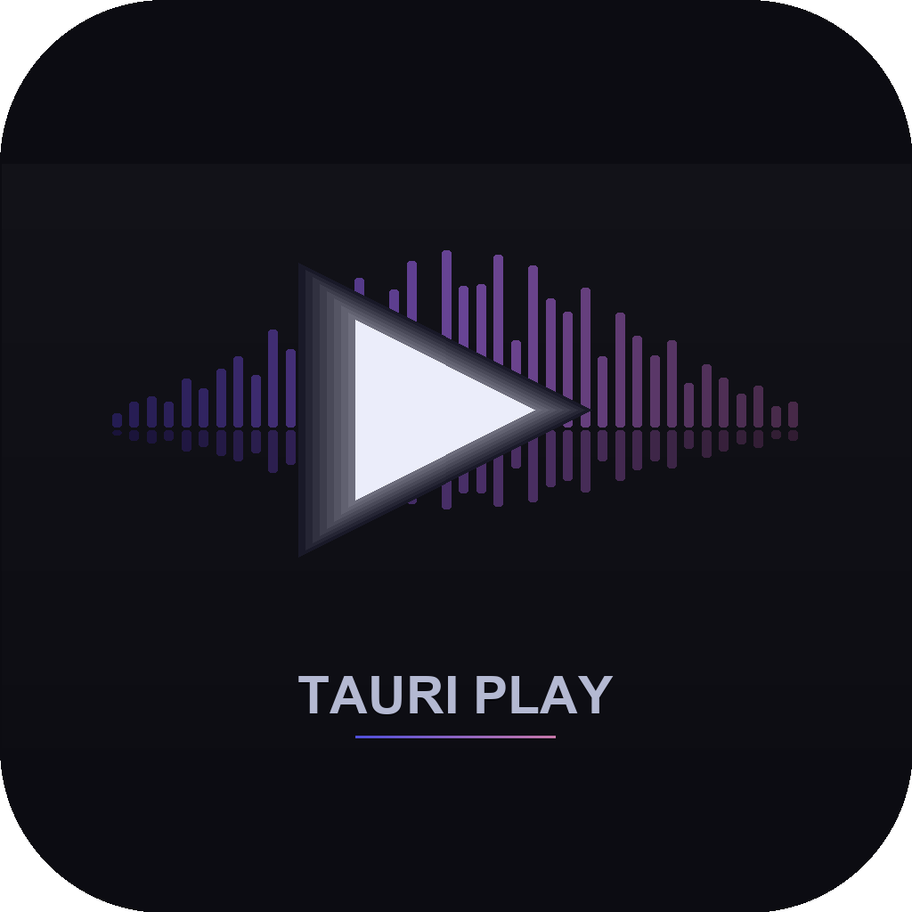

# Tauri Play

<p align="center">
  
</p>

<p align="center">
  A standalone desktop media player built with <strong>Tauri 2</strong>, <strong>React 19</strong>, and <strong>Rust</strong>.<br/>
  Plays local audio/video files and streams from Google Drive, with waveform visualization, playlist management, drag-and-drop, and metadata editing.
</p>

## Features

- **Local media playback** -- MP3, FLAC, WAV, OGG, AAC, M4A, WMA, MP4, MKV, AVI, WebM, MOV
- **Google Drive streaming** -- Browse and play audio/video from your Drive with OAuth 2.0
- **Waveform visualization** -- Real-time canvas waveform with click-to-seek
- **Metadata display & editing** -- Read/write ID3v2, Vorbis, MP4 tags via lofty
- **Background metadata hydration for Google Drive** -- After each background sync tick, freshly-discovered cloud tracks have their tags fetched and decoded automatically (downloaded to a throwaway temp path, parsed by lofty, then deleted) so the library shows real titles, artists, and album art without the user having to play each track first
- **Stable library ordering** -- Once a track appears in the library view it keeps its row position; metadata updates from background hydration no longer cause rows to jump around mid-listen
- **Album artwork** -- Extracted from files, deduplicated by SHA-256, served with caching
- **Playlists** -- Create, reorder (drag-and-drop), and manage playlists; auto-detect M3U/M3U8
- **Drag and drop** -- Drag tracks from the library onto playlists in the sidebar
- **Queue management** -- Play next, add to queue, clear queue, reorder
- **Now Playing sidebar** -- Collapsible right-hand panel with large artwork, mini waveform, full track details, and an always-visible Up Next queue
- **Customizable columns** -- Show/hide and reorder library columns, persisted across sessions
- **Multi-row selection** -- Click, Cmd/Ctrl-click, and Shift-click to select multiple tracks; Delete/Backspace removes the selection (with confirm)
- **Bulk track removal** -- Remove single tracks or whole multi-selections from the library, including cascade cleanup of file cache, waveform cache, playlist entries, and orphan artwork
- **Search & sort** -- Filter tracks by title/artist/album/genre; click column headers to sort
- **Source filter** -- Toggle between All / Local / Cloud tracks with live counts in the library header
- **Background sync** -- Periodically checks for new/changed files in configured directories and selected Google Drive folders
- **Smart Scan button** -- "Scan Google Drive" is automatically disabled when no Drive folders are selected, with a tooltip explaining why
- **Per-folder Drive scoping** -- Selectively pick which Drive folders to index instead of walking the entire account; folder removals delete only the tracks that folder contributed
- **File caching** -- LRU cache for Google Drive files (configurable, default 2 GB), separate from the metadata-only sync path
- **Volume control** -- Mute/unmute with slider
- **Context menus** -- Right-click for play, queue, playlist, and reload actions
- **Dark theme** -- Full dark UI built with Tailwind CSS

## Architecture

**Frontend (React 19 + TypeScript)**        

**Backend (Rust)**

**Streaming server** runs on `http://127.0.0.1:9876` (Axum) handling local file serving with HTTP Range requests and Google Drive proxy streaming.

**Database** is SQLite (rusqlite, bundled) with WAL mode. Schema auto-migrates via `PRAGMA user_version`.

## Requirements

### System

| Requirement | Version |
|---|---|
| **Node.js** | >= 18 |
| **pnpm** | >= 8 |
| **Rust** | stable (latest) |
| **macOS** | 11+ (Big Sur or later) |
| **Xcode Command Line Tools** | Required on macOS |

> **Linux/Windows**: Tauri 2 supports these platforms but this project has been developed and tested on macOS. See the [Tauri prerequisites](https://v2.tauri.app/start/prerequisites/) for platform-specific requirements.

### Install prerequisites

```bash
# Install Rust
curl --proto '=https' --tlsv1.2 -sSf https://sh.rustup.rs | sh

# Install Node.js (via nvm)
curl -o- https://raw.githubusercontent.com/nvm-sh/nvm/v0.40.0/install.sh | bash
nvm install 22

# Install pnpm
corepack enable
corepack prepare pnpm@latest --activate

# macOS: Install Xcode Command Line Tools
xcode-select --install
```

## Getting Started

### Clone and install

```bash
git clone <repo-url> tauri-play
cd tauri-play
pnpm install
```

### Development

```bash
pnpm tauri dev
```

This starts both the Vite dev server and the Tauri Rust backend with hot reload. Developer tools open automatically in debug builds (`Cmd+Option+I` to toggle).


### Production build

```bash
# Build for all targets
pnpm tauri build

# macOS-specific
pnpm bundle:dmg    # Creates .dmg installer
pnpm bundle:app    # Creates .app bundle
```

Build output goes to `src-tauri/target/release/bundle/`.

## Usage

### Adding music

1. Click **Add Folder** in the Library toolbar or go to **Settings > Local Sources**
2. Select a directory containing audio/video files
3. Click **Scan** -- the app recursively finds media files and reads metadata

### Playing tracks

- **Double-click** a track to play (sets the queue to the current list)
- **Hover** over album art for a play button overlay
- **Right-click** a track for options: Play, Play Next, Add to Queue, Add to Playlist

### Playlists

- Click **+** in the sidebar to create a playlist
- **Drag** tracks from the library onto a playlist in the sidebar
- **Drag** tracks within a playlist to reorder
- M3U/M3U8 playlists in scanned directories are auto-detected

### Google Drive Setup

To stream music from Google Drive:

1. Go to **Settings > Google Drive**
2. Click **"First time? Set up OAuth credentials"**
3. Follow the step-by-step guide to create a Google Cloud project:
   - Create a project at [Google Cloud Console](https://console.cloud.google.com/projectcreate)
   - Enable the [Google Drive API](https://console.cloud.google.com/apis/library/drive.googleapis.com)
   - Create OAuth 2.0 credentials (Web application type)
   - Add `http://127.0.0.1:1421` as an authorized redirect URI
   - Configure the [OAuth consent screen](https://console.cloud.google.com/apis/credentials/consent) (add your email as test user)
4. Paste the Client ID and Client Secret, click **Save & Connect**
5. Sign in with your Google account in the browser
6. Browse and select folders to scan in the app

## Project Scripts

| Script | Description |
|---|---|
| `pnpm tauri dev` | Start app in development mode |
| `pnpm tauri build` | Production build |
| `pnpm tauri:build:debug` | Debug build with symbols |
| `pnpm bundle:dmg` | Build macOS .dmg installer |
| `pnpm bundle:app` | Build macOS .app bundle |
| `pnpm dev` | Vite dev server only (no Tauri) |
| `pnpm build` | Frontend build only |

## Tech Stack

### Frontend
- [React 19](https://react.dev/) -- UI framework
- [TypeScript 5.8](https://www.typescriptlang.org/) -- Type safety
- [Zustand 5](https://zustand.docs.pmnd.rs/) -- State management
- [Tailwind CSS 4](https://tailwindcss.com/) -- Styling
- [@dnd-kit](https://dndkit.com/) -- Drag-and-drop
- [Vite 6](https://vite.dev/) -- Build tool

### Backend
- [Tauri 2](https://v2.tauri.app/) -- Desktop app framework
- [Axum 0.8](https://github.com/tokio-rs/axum) -- HTTP streaming server
- [Tokio](https://tokio.rs/) -- Async runtime
- [rusqlite 0.31](https://github.com/rusqlite/rusqlite) -- SQLite (bundled)
- [lofty 0.22](https://github.com/Serial-ATA/lofty-rs) -- Audio metadata read/write
- [symphonia 0.5](https://github.com/pdeljanov/Symphonia) -- Audio decoding for waveforms
- [reqwest 0.12](https://github.com/seanmonstar/reqwest) -- HTTP client (Google Drive API)

## Versioning

This repository follows [Semantic Versioning 2.0.0](https://semver.org/spec/v2.0.0.html).
Every release is documented in [CHANGES.md](CHANGES.md), which is structured per
[Keep a Changelog 1.1.0](https://keepachangelog.com/en/1.1.0/) and separates
**Added** (new features) from **Fixed** (bug fixes), with additional sections
for **Changed**, **Deprecated**, **Removed**, and **Security** as needed.

Version numbers use the form `MAJOR.MINOR.PATCH`:

- **MAJOR** -- incompatible changes to the on-disk database schema, settings format, or Tauri command API surface that break existing installs.
- **MINOR** -- backward-compatible new features (new commands, new UI views, new providers, additional metadata fields).
- **PATCH** -- backward-compatible bug fixes, performance improvements, or internal refactors.

Pre-1.0.0 releases (`0.y.z`) are considered initial development and may
introduce breaking changes in any release; the public API is not yet stable.

Pre-release and build metadata suffixes follow the spec:

- `1.2.0-alpha.1`, `1.2.0-beta.2`, `1.2.0-rc.1` for pre-releases
- `1.2.0+20260411` for build metadata (ignored for precedence)

### Release checklist

On every release, **all four** of the following must be updated together so the
manifests, the changelog, and the git tag agree:

| File | Field |
|---|---|
| `package.json` | `"version"` |
| `src-tauri/Cargo.toml` | `[package] version` |
| `src-tauri/tauri.conf.json` | `"version"` |
| `CHANGES.md` | new dated section under the appropriate version, with changes grouped into **Added** / **Changed** / **Deprecated** / **Removed** / **Fixed** / **Security** |

The version recorded at the top of `CHANGES.md` is the source of truth -- the
three manifest files must match it exactly.

## License

MIT -- see [LICENSE](LICENSE).
